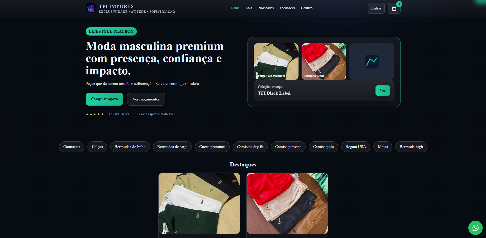

# 🛍️ TFI IMPORTS - E-commerce de Moda Masculina Premium




## 📋 Sobre o Projeto

TFI IMPORTS é uma plataforma de e-commerce especializada em moda masculina premium, oferecendo uma experiência de compra moderna e intuitiva com integração completa de pagamentos e frete.

### ✨ Características Principais

- 🛒 **Carrinho de Compras** - Sistema completo de carrinho com persistência
- 💳 **Pagamentos** - Integração com Asaas (PIX, Cartão, Boleto)
- 🚚 **Cálculo de Frete** - API SuperFrete com múltiplas transportadoras
- 🔐 **Autenticação** - Login com Google e Email/Senha via Firebase
- 📱 **Responsivo** - Design adaptável para todos os dispositivos
- ⚡ **Performance** - Carregamento rápido com Vite
- 🔒 **Segurança** - CSP, validações e sanitização de dados

## 🚀 Tecnologias Utilizadas

### Frontend
- **HTML5** - Estrutura semântica
- **CSS3** - Estilização com Tailwind CSS
- **JavaScript ES6+** - Lógica da aplicação
- **Vite** - Build tool e dev server

### Backend & Serviços
- **Netlify Functions** - Serverless functions
- **Firebase** - Autenticação e banco de dados
- **Asaas** - Gateway de pagamento
- **SuperFrete** - API de cálculo de frete

### Ferramentas
- **ESLint** - Linting de código
- **Terser** - Minificação
- **Node.js** - Runtime para funções

## 📁 Estrutura do Projeto

```
tfi-imports/
├── 📄 index.html              # Página principal
├── 📄 package.json            # Dependências e scripts
├── 📄 netlify.toml            # Configuração do Netlify
├── 📄 vite.config.js          # Configuração do Vite
├── 📄 firestore.rules         # Regras de segurança do Firestore
├── 📄 enviar.env              # Variáveis de ambiente
├── 📁 netlify/
│   └── 📁 functions/
│       └── 📄 super-frete.js  # Função para cálculo de frete
├── 📄 super-frete.js          # Cliente SuperFrete
├── 📄 asaas.js               # Cliente Asaas
├── 📄 mercado-pago.js        # Cliente Mercado Pago
├── 📄 order-manager.js       # Gerenciador de pedidos
├── 📄 config.js              # Configuração Firebase
├── 📄 api-config.js          # Configuração APIs
└── 📄 security.js            # Funções de segurança
```

## 🛠️ Instalação e Configuração

### 1. Clone o Repositório
```bash
git clone https://github.com/seu-usuario/tfi-imports.git
cd tfi-imports
```

### 2. Instale as Dependências
```bash
npm install
```

### 3. Configure as Variáveis de Ambiente

Crie um arquivo `.env` na raiz do projeto:
```env
# Firebase Configuration
VITE_FIREBASE_API_KEY=your_firebase_api_key
VITE_FIREBASE_AUTH_DOMAIN=your_project.firebaseapp.com
VITE_FIREBASE_PROJECT_ID=your_project_id
VITE_FIREBASE_STORAGE_BUCKET=your_project.appspot.com
VITE_FIREBASE_MESSAGING_SENDER_ID=your_sender_id
VITE_FIREBASE_APP_ID=your_app_id
VITE_FIREBASE_MEASUREMENT_ID=your_measurement_id

# Asaas Configuration
VITE_ASAAS_API_KEY=your_asaas_api_key
VITE_ASAAS_ENVIRONMENT=sandbox
VITE_ASAAS_WEBHOOK_TOKEN=your_webhook_token

# Super Frete Configuration
SUPER_FRETE_API_KEY=your_superfrete_api_key

# App Environment
VITE_APP_ENV=production
```

### 4. Configure o Netlify

No painel do Netlify, configure as variáveis de ambiente:
- Vá em **Site settings** > **Environment variables**
- Adicione todas as variáveis do arquivo `.env`

### 5. Execute o Projeto

#### Desenvolvimento
```bash
npm run dev
```

#### Build para Produção
```bash
npm run build
```

#### Preview da Build
```bash
npm run preview
```

## 🔧 Scripts Disponíveis

```bash
npm run dev          # Inicia servidor de desenvolvimento
npm run build        # Gera build de produção
npm run preview      # Preview da build
npm run lint         # Executa ESLint
npm run security-check # Verifica vulnerabilidades
```

## 🚚 Integração SuperFrete

### Configuração
A integração com o SuperFrete está configurada para:
- **CEP de Origem:** 01153-000 (São Paulo)
- **Transportadoras:** PAC, SEDEX, Mini Envios
- **Fallback:** Cálculo local em caso de erro

### Endpoint
```
POST /.netlify/functions/super-frete
```

### Payload
```json
{
  "cepDestino": "01310930",
  "peso": 0.3,
  "valor": 19.9,
  "dimensoes": {
    "height": 2,
    "width": 11,
    "length": 16
  }
}
```

### Resposta
```json
{
  "success": true,
  "options": [
    {
      "id": "pac",
      "name": "PAC",
      "company": "Correios",
      "price": 12.50,
      "delivery_time": "5-8 dias úteis"
    }
  ],
  "api_used": "super_frete_api"
}
```

## 💳 Integração Asaas

### Métodos de Pagamento Suportados
- **PIX** - Pagamento instantâneo
- **Cartão de Crédito** - Parcelamento
- **Boleto** - Pagamento à vista

### Webhook
Configure o webhook do Asaas para:
```
https://tfimports01.com.br/.netlify/functions/asaas-webhook
```

## 🔐 Segurança

### Content Security Policy (CSP)
```html
default-src 'self';
script-src 'self' 'unsafe-inline' https://cdn.tailwindcss.com;
style-src 'self' 'unsafe-inline' https://cdn.tailwindcss.com;
connect-src 'self' https://*.firebaseapp.com https://api.superfrete.com;
```

### Validações
- Sanitização de inputs
- Rate limiting
- Validação de CEP
- Verificação de dados de pagamento

## 📱 Funcionalidades

### 🛒 E-commerce
- [x] Catálogo de produtos
- [x] Carrinho de compras
- [x] Cálculo de frete
- [x] Checkout completo
- [x] Histórico de pedidos

### 👤 Usuário
- [x] Cadastro e login
- [x] Perfil do usuário
- [x] Favoritos
- [x] Endereços salvos

### 🔧 Administração
- [x] Painel administrativo
- [x] Gestão de produtos
- [x] Relatórios de vendas
- [x] Configurações da loja

## 🚀 Deploy

### Netlify (Recomendado)
1. Conecte o repositório ao Netlify
2. Configure as variáveis de ambiente
3. Deploy automático via Git

### Build Settings
- **Build command:** `npm run build`
- **Publish directory:** `dist`
- **Functions directory:** `netlify/functions`

## 🧪 Testes

### Testar Cálculo de Frete
```javascript
// No console do navegador
fetch('/.netlify/functions/super-frete', {
  method: 'POST',
  headers: { 'Content-Type': 'application/json' },
  body: JSON.stringify({
    cepDestino: '01310930',
    peso: 0.3,
    valor: 19.9
  })
})
.then(r => r.json())
.then(data => console.log(data));
```

### Testar Conectividade
```javascript
// Verificar configurações
window.checkAllConfigs();
```

## 📊 Monitoramento

### Logs
- **Netlify Functions:** Logs automáticos
- **Firebase:** Console do Firebase
- **Asaas:** Dashboard do Asaas

### Métricas
- Performance do site
- Taxa de conversão
- Erros de pagamento
- Tempo de carregamento

## 🤝 Contribuição

1. Fork o projeto
2. Crie uma branch para sua feature (`git checkout -b feature/AmazingFeature`)
3. Commit suas mudanças (`git commit -m 'Add some AmazingFeature'`)
4. Push para a branch (`git push origin feature/AmazingFeature`)
5. Abra um Pull Request

## 📝 Licença

Este projeto está sob a licença MIT. Veja o arquivo [LICENSE](LICENSE) para mais detalhes.

## 📞 Suporte

- **Email:** contato@tfiimports.com.br
- **Website:** https://tfimports01.com.br
- **Documentação:** [Wiki do Projeto](https://github.com/seu-usuario/tfi-imports/wiki)

## 🙏 Agradecimentos

- [Tailwind CSS](https://tailwindcss.com/) - Framework CSS
- [Vite](https://vitejs.dev/) - Build tool
- [Firebase](https://firebase.google.com/) - Backend services
- [Netlify](https://netlify.com/) - Hosting e Functions
- [Asaas](https://asaas.com/) - Gateway de pagamento
- [SuperFrete](https://superfrete.com.br/) - API de frete

---

<div align="center">
  <p>Desenvolvido com ❤️ por <strong>ELEVARE</strong></p>
  <p>© 2025 TFI IMPORTS. Todos os direitos reservados.</p>
</div>
